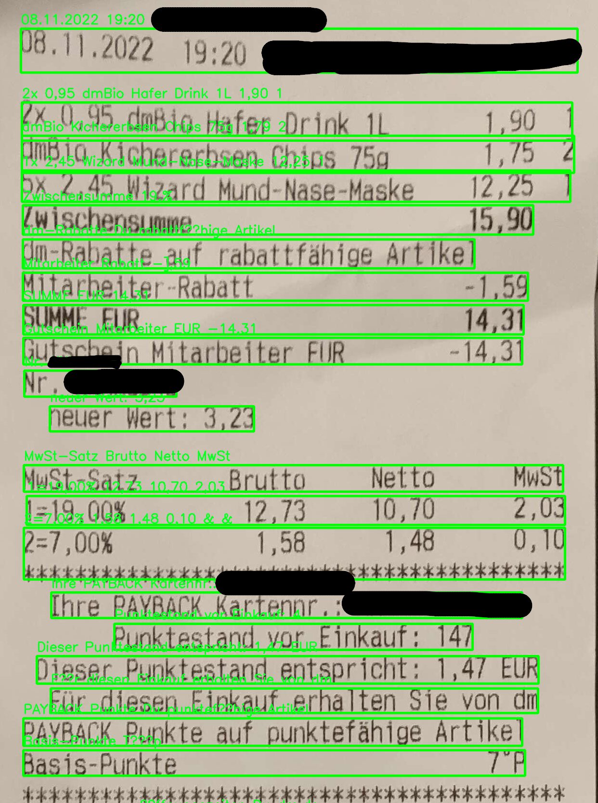

# Proof of Concept of scanning a receipt

Sample images of a Kassenbeleg or Kassenbon (receipt) should be put under assets/.
For privacy reasons, they are not checked out into this repository.



Sample processing results:
```
--- RECEIPT POSITIONS ---

2x 0,95 dmBio Hafer Drink 1L 1 -> 1,9
dmBio Kichererbsen Chips 75g 2 -> 1,15
3x Ware Murd-Nase-Maske 1 -> 12,25 [notice the typo here!]
Zwischensumme -> 15,9
Mitarbeiter Rabatt -> -1,59
SUMME. EUR -> 14,31
Gutschein Mitarbeiter EUR -> -14,31
neuer Wert -> 3,23
 -> 2,03
2 ,00% -> 0,10
neuer Punktestand entspricht: EUR -> 1,47

--- RECEIPT POSITIONS ---
```

## Weaknesses that came up during the evaluation

As you can see, further processing is needed to make the data extraction work as well as to detect what are important pieces of the receipt and which may be discarded (e.g. tax information).

## Introduction

This document outlines the technical details for our proof of concept software that allows for the extraction of receipt positions from images containing a receipt. This software is designed for developers and technical users who have experience working with image processing and OCR technology.

To use our software, you must first install the necessary dependencies. Our software requires the following libraries and tools:
- Python 3.11 or higher
- OpenCV 4.7 or higher
- Tesseract OCR 5.3 or higher with the German language data file (Tip for macOS user: `brew install tesseract-lang`)

Once you have installed these dependencies, you can download and install the PoC from the GitHub repository using the following command:

```
git clone https://github.com/jens1o/scan-receipt-poc.git
````

## Getting Started

Put some images into assets/ and make sure `scan-receipt.py` is picking up your image by adjusting the very last line.

## Technical Documentation

### Image preparation
To make it easier for tesseract to extract texts (hence improve the quality), the image needs to be prepared for OCR.

We first use a binary thresholding approach. Thresholding is used to segment the image into foreground and background.
First, the RGB colorspace is changed to a grayscale scala.
Then, depending on their grayscale value, they are either put black or white based on a thresholding value.
This improves accuracy significantly.

### Text Extraction

Our software uses Tesseract OCR to extract text from the image. Tesseract OCR is an open source OCR engine that is widely used in the industry. Our software uses the Python wrapper for Tesseract OCR, pytesseract.

OCR stands for Optical Character Recognition and is the technology that enables software to detect letters/words/numbers on images and "digitize" them.

Tesseract returns, next to the text recognized, some data about confidence (how sure Tesseract is), as well as data related to the word number, the line number etc.

The text recognized by OCR may not be accurate.
To improve accuracy, higher quality images must be provided.
Another strategy that was evaluated here is to use a spell checking strategy combined with a custom dictionary.
Based on their edit distance (that is, how many characters need to be modified to get to the term) they are corrected to what seems feasible.

In the future, the dictionary should contain all name of products known.
This makes a significant difference and improves the results drastically. (Higher quality is necessary to not confuse users.)

In this PoC, it is assumed that the receipt is read from left-to-right and the price is the last information worth extracting.
So, further processing is based on the fact that everything before something that looks like a price is categorized as the name of the receipt position.
Then, after the price is discovered, everything in the same line is ignored.

## Contact
Please don't hesitate to ask the author of this PoC, @jens1o.